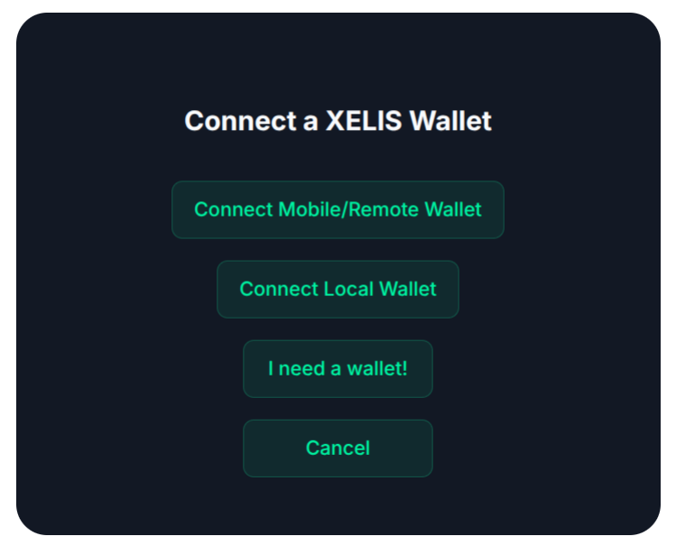
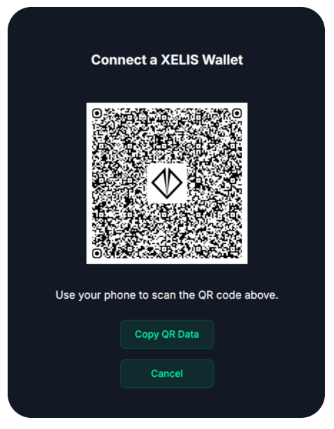
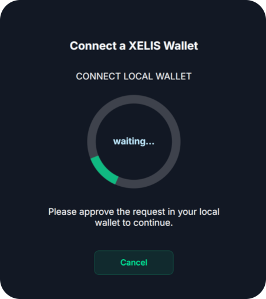

# xelis-wallet-connect

A lightweight, robust web library designed to connect applications and dApps to Xelis Blockchain wallets. It provides a built-in user interface to easily switch between local and remote/mobile wallets using the secure XSWD protocol.

This library relies on [@xelis/xswd-connect](https://github.com/xelis-project/xswd-connect) for secure WebSocket connections, QR Code generation, and wallet interaction schemas.

---

## Screenshots
<div align="center"></div>
<div align="center"></div>
<div align="center"></div>

## Features

- 🔌 **Dual Connection Support**: Easily connect to either **Local Wallets** (e.g. [xelis-wallet](https://docs.xelis.io/getting-started/guides/wallet-cli (CLI))) or **Remote/Mobile Wallets** (e.g. [Genesix Wallet](https://github.com/xelis-project/xelis-genesix-wallet)). 
- 🖥️ **Built-in UI Component**: Comes with a ready-to-use, responsive modal overlay that manages the connection selection state, shows approval prompts, and renders connection QR codes. 
- 📱 **QR Code Styling**: Automatically displays styled QR codes with embedded center logos for seamless mobile scanner connection. 
- 🔔 **Event-Driven Architecture**: Built on top of the native browser `EventTarget` api. Easily listen to state changes (`wallet-ready`, `wallet-disconnect`, `connection-data-received`, etc.). 
- 🛠️ **Configurable Permissions**: Declare granular permissions required by your DApp upon connection initialization.

---

## Installation

### Manually 
In your ``package.json`` file, add the following to the ``dependencies`` section:
```json
"@xelis/xelis-wallet-connect": "https://github.com/codehalo/xelis-wallet-connect#main"
```

then run 
```bash
npm update
```
<!--
Install the package via npm:

```bash
Forthcoming <npm install @xelis/xelis-wallet-connect
```
-->
---

## Quick Start

### 1. Example: Basic configuration and connection:

```typescript
import { XelisWallet } from '@xelis/xelis-wallet-connect';

// The HTML container where the wallet connection UI will render
const container = document.getElementById('wallet-container') as HTMLDivElement;

// Connects to the wallet, but does nothing else...
const xelisWallet = new XelisWallet(container,
  {
    appData: {
      name: "A Sample Xelis App",
      description: "A simple DApp",
      permissions: ["get_address", "get_balance", "network_info"]
    }
  });
  
  // ... work with `xeliswallet` object in this application ....
```

### 2. Example with more configuration options and events:
Here is a complete, minimal example showing how to initialize `XelisWallet` and fetch the user's wallet address:

```typescript
import { XelisWallet, WalletLocal, WalletRemote, WalletDefaults } from '@xelis/xelis-wallet-connect';

const container = document.getElementById('wallet-container') as HTMLDivElement;

// These are the permissions the dApp is requesting from the wallet.
// By default, users will have to approve these permissions every time they connect to the dApp.
// All of the RPC methods that the dApp will use must be included in the permissions array.

const PERMISSIONS = [
  "get_address",
  "get_balance",
  "network_info"
];

// Instantiate XelisWallet
const myWallet = new XelisWallet(container,
  {
    appData: {
      name: "Another Xelis App 2",
      description: "A simple DApp",
      permissions: PERMISSIONS
    },
    qrCodeOptions: {
      color: "#000000",
      backgroundColor: "#FFFFFF",
      // Path to your logo shown in center of QR, eg. "/favicon.svg".
      // CAUTION: If the file path is wrong, the QR code will not be generated!
      // Leave empty for no logo.
      logoUrl: "",
      logoSize: 0.2,
      centerBackgroundColor: '#FFFFFF'
    },
    relayerUrl: WalletDefaults.RELAYER_XELIS,
    uiOptions: {
        theme: 'basic-theme'
    }
  });

myWallet.addEventListener("wallet-ready", (event: Event) => {
  console.debug("Wallet Ready");

  // OPTIONAL. Prefetching permissions avoids wallet popups every time the app requests permissions.
  const xswd_prefetch = {
    "id": "XSWD_PREFETCH_PERMISSIONS",
    "jsonrpc": "2.0",
    "method": "xswd.prefetch_permissions",
    "params": {
      "reason": "User convenience.",
      "permissions": PERMISSIONS
    }
  };

  if (myWallet.wallet !== null) {
    myWallet.wallet.send_query(JSON.stringify(xswd_prefetch));
  }
});

// Listen for connection events
myWallet.addEventListener("wallet-ready", () => {
    console.log("Wallet connection approved and ready!");
    
    // Request the wallet address using JSON-RPC standard format
    const query = JSON.stringify({
        id: 1,
        jsonrpc: "2.0",
        method: "wallet.get_address"
    });
    myWallet.send_query(query);
});

// Listen for incoming data/responses from the wallet
myWallet.addEventListener("connection-data-received", (e: Event) => {
  
  const event = e as CustomEvent;
  
  const response = event.detail.data;
    console.log("Received data from wallet:", response);
    
    if (response.id === 1 && response.result) {
        console.log("Wallet Address:", response.result);
    }
});

// Handle disconnections
// Fired when the "Disconnect" btn is clicked
myWallet.addEventListener("wallet-will-disconnect", () => {
    console.log("Wallet disconnecting.");
});

// on disconnect
myWallet.addEventListener("wallet-disconnect", () => {
    console.log("Wallet disconnected.");
});

// Handle connection failures
myWallet.addEventListener("wallet-connect-error", (e: Event) => {
    const error = e as CustomEvent;
    console.error("Wallet connection failed:", error.detail);
});
```

---

## API Configuration Options

### `WalletConfig`
When instantiating `XelisWallet`, you pass a configuration object which contains `appData`, `qrCodeOptions`, `uiOptions`, and `relayerUrl`:

| Property | Type | Description |
| :--- | :--- | :--- |
| `appData.id` | `string` | Unique identifier for your app (automatically generated if not specified). |
| `appData.name` | `string` | **Required**. Display name of your DApp shown to the user during approval. |
| `appData.description` | `string` | **Required**. Short description of your DApp. |
| `appData.url` | `string` | **Required**. The URL of your DApp (defaults to current window location). |
| `appData.permissions` | `string[]` | List of actions or data fields your app requests access to. |
| `qrCodeOptions.color` | `string` | Color of the QR code modules (default: `#000000`). |
| `qrCodeOptions.backgroundColor` | `string` | Background color of the QR code (default: `#FFFFFF`). |
| `qrCodeOptions.logoUrl` | `string` | Path or URL to a logo positioned in the center of the QR code. MAKE SURE THE ACTUAL ASSET EXISTS, or the QR code image will not be generated!  |
| `qrCodeOptions.logoSize` | `number` | Size of the logo as a percentage of the total QR code size (default: `0.2`). |
| `qrCodeOptions.centerBackgroundColor` | `string` | Color of the background behind the logo (default: `#FFFFFF`). |
| `relayurl` | `string` | When connecting to a remote wallet, [the relayer](https://github.com/xelis-project/xswd-relayer) that facilitates communication between the dapp and the wallet. (default: `wss://relay.xelis.io/ws`). |
| `uiOptions` | `object` | Options for the UI of the wallet. |
| `uiOptions.theme` | `string` | Use a theme for the wallet. If omitted, it uses the `basic-theme`, if `'none'` or blank, no styling is used. (default: `basic-theme`). |
| `uiOptions.walletMainPageTitle` | `string` | Set title for the wallet main page. (default: `Connect a XELIS wallet`). |
| `uiOptions.connectLocalButtonText` | `string` | Set text for the local connect button. (default: `Connect Local Desktop Wallet`). |
| `uiOptions.connectRemoteButtonText` | `string` | Set text for the remote connect button. (default: `Connect using QR Code`). |
| `uiOptions.getWalletButtonText` | `string` | Set text for the button that leads to [xelis.io/resources](https://xelis.io/resources). (default: `I need a Wallet`). |
| `uiOptions.mainCancelButtonText` | `string` | Set text for the main cancel button. (default: `Cancel`). |

---

## Event Reference

Since `XelisWallet` inherits from `EventTarget`, you can use `addEventListener` to capture connection lifecycle events:

* **`wallet-ready`**: Fired when the user approves the connection request in their wallet. The WebSocket channel is fully open.
* **`connection-data-received`**: Fired when the wallet returns a message or event. The response payload is available inside `event.detail.data`.
* **`wallet-will-disconnect`**: Fired if the wallet `disconnect` button is utilized when disconnecting.
* **`wallet-disconnect`**: Fired when the WebSocket connection to the wallet is closed.
* **`wallet-connect-error`**: Fired when a connection attempt fails (e.g., local companion app is not running).

---

## Utilities & Helper Classes

The library also exports key helper utilities and classes:

- **`WalletDefaults`**: Contains constant defaults for RPC port, XSWD port, Node URLs (Mainnet, Testnet, Local), and the native token asset hash (`XEL_HASH_ID`).
- **`WalletMethodID`**: A dictionary containing method IDs (such as `GET_ADDRESS`, `GET_BALANCE`, `NEW_TOPO_HEIGHT`) to quickly coordinate requests and parse responses.
- **`WalletLocal` & `WalletRemote`**: Underlying connection clients used by `XelisWallet` for local and remote communication.
